[backroomlabs.net](https://backroomlabs.net) &nbsp;·&nbsp;
[instagram](https://www.instagram.com/christian.is.me017) &nbsp;·&nbsp;
[in/christian-mills](https://www.linkedin.com/in/christian-mills/) &nbsp;·&nbsp;
[Buy Me a Coffee!](https://buymeacoffee.com/christianmills17)

> Mechanical engineering undergrad, but I solder and write TypeScript 
> in roughly equal measure. EE + ME + CS because I couldn't pick one.

I build local-first desktop apps and the hardware to run them on. Right now 
that's [beech](#) — a newsletter curator that lives on your own disk and never 
phones home — plus the ESP32 boards and PCBs that show up next to it when 
I'm not looking. I finish things, mostly outside the tracker.

<samp>python &nbsp; c++ &nbsp; typescript &nbsp; electron &nbsp; git &nbsp; linux &nbsp; pcb</samp>

**[beech](https://github.com/Runtime-3rr0r/beech)** &nbsp;·&nbsp; <samp>typescript, electron</samp> 
Local-first AI newsletter curator. Reads your feed, drafts summaries, keeps 
your reading history on disk. No cloud, no sub.

**[willow](https://github.com/Runtime-3rr0r/willow)** &nbsp;·&nbsp; <samp>typescript, electron</samp> 
The workspace I run my hardware projects out of. Kanban, gerber files, 
BOM and assembly tracking, a parts inventory, and an order planner.

**[7983S_Worlds](https://github.com/Runtime-3rr0r/7983S_Worlds)** &nbsp;·&nbsp; <samp>c++</samp> 
The VEX Team 7983S competition code. Autonomous routines, control loops, 
and the driver-assist math that scores points.

**[MechLab-2D](https://github.com/Runtime-3rr0r/MechLab-2D)** &nbsp;·&nbsp; <samp>python</samp> 
A 2D sandbox of mechanics — springs, collision, momentum, the fun kind 
of physics homework that installs as a game.

